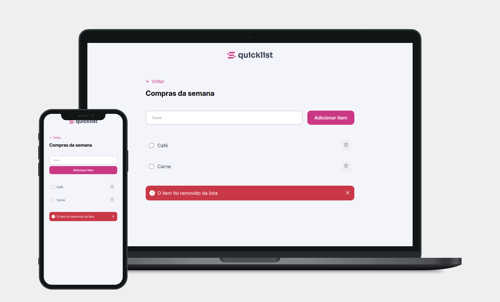

# **quicklist** - Lista de Compras

Aplicativo de lista de tarefas desenvolvido como desafio proposto pelos orientadores durante a formação Beta Hub.



##  Tecnologias usadas

- **HTML**
- **CSS**
- **JS**

## Como Executar o Projeto

1. Clone o repositório:

```
git clone https://github.com/ReddyyZ/quicklist.git
```

2. Abra o index.html em seu navegador preferido

---

<h1 align="center">&lt;/&gt; by <a href="https://github.com/ReddyyZ">ReddyyZ</a></h1>